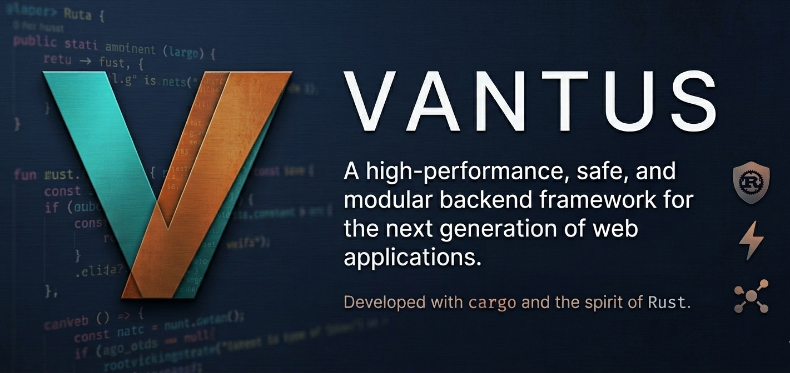

<p align="center">
  
</p>

# `vantus`

`vantus` is a macro-first async Rust backend framework built around explicit composition, typed request extraction, and production-oriented HTTP defaults.

Companion docs:

- [docs/cli-reference.md](docs/cli-reference.md)
- [docs/quick-start.md](docs/quick-start.md)
- [docs/configuration-reference.md](docs/configuration-reference.md)
- [docs/production-notes.md](docs/production-notes.md)
- [docs/publishing-checklist.md](docs/publishing-checklist.md)
- [SECURITY.md](SECURITY.md)

## Core model

- Use `HostBuilder` to load configuration, apply runtime limits, and mount modules.
- Use `#[module]` and `#[controller]` for route definition.
- Construct application dependencies yourself with normal Rust constructors and pass them into modules/controllers explicitly.
- Use request-derived handler inputs only: `RequestContext`, `Path<T>`, `Query<T>`, `Header<T>`, `QueryMap`, `BodyBytes`, `TextBody`, `JsonBody<T>`, `RequestState<T>`, `IdentityState<T>`, and safe optional variants.

Runtime DI-style handler injection is no longer part of the supported public API.

## Quick start

```rust
use std::time::Duration;

use serde::Serialize;
use vantus::{HostBuilder, RequestContext, Response, TextBody, module};

#[derive(Clone)]
struct GreetingModule {
    service_name: String,
}

#[derive(Serialize)]
struct GreetingPayload {
    service: String,
    message: String,
}

#[module]
impl GreetingModule {
    #[vantus::post("/greet")]
    fn greet(&self, ctx: RequestContext, body: TextBody) -> GreetingPayload {
        GreetingPayload {
            service: self.service_name.clone(),
            message: format!("{}: {}", ctx.app_config().environment, body.as_str()),
        }
    }
}

fn main() {
    let mut builder = HostBuilder::new();
    builder.request_timeout(Duration::from_secs(5));
    builder.max_body_size(64 * 1024);
    builder.compose_with_config(|_configuration, app, context| {
        context.module(GreetingModule {
            service_name: app.service_name.clone(),
        });
        Ok(())
    });
    builder.build().run_blocking();
}
```

See [examples/main.rs](examples/main.rs) for the runnable example.

## Request contracts

Route contracts are inferred from handler signatures and enforced before the handler runs.

- `JsonBody<T>` requires `Content-Type: application/json`
- `TextBody` requires `Content-Type: text/plain`
- `BodyBytes` accepts any media type
- handlers without a body extractor reject non-empty request bodies
- `GET`, `HEAD`, and `OPTIONS` handlers cannot declare body extractors
- wrong-method matches return `405 Method Not Allowed` with an `Allow` header

## Middleware

Attach middleware declaratively with `#[middleware(Type)]` on a module/controller impl or an individual route method.

- middleware types must implement `Middleware` and `Default`
- impl-level middleware wraps route-level middleware
- repeated attributes run in source order

## Observability

`ObservabilityModule` adds:

- `X-Request-Id` generation using the configured `IdGenerator`
- structured request logging
- `/live`, `/ready`, `/diag`, and `/metrics`
- readiness contributor registration
- runtime counters and per-route latency totals

`vantus` does not install a global tracing subscriber or exporter for you. Wire those explicitly in your binary so logging, tracing, and metrics stay under application control.

The default ID generator is `UuidIdGenerator`. `AtomicIdGenerator` remains available for tests and local demos, but it is no longer the default.

## Configuration

`ConfigurationBuilder` merges:

- `application.properties`
- `application.{profile}.properties`
- environment variables with the configured prefix, default `APP_`

`AppConfig` remains the built-in runtime configuration model. For application-specific config, bind your own type from `Configuration` inside `compose_with_config(...)` and pass the resulting values into your modules explicitly.

## Security and operations

- `HostBuilder::max_body_size(...)` enforces request body size before middleware
- `HostBuilder::request_timeout(...)` sets the outer request deadline
- `HostBuilder::rate_limiter(...)` applies pre-middleware token-bucket throttling
- HTTP/1.1 requests require a valid `Host` header
- content-type and method/body mismatches are rejected early
- TLS termination, CORS, compression, and auth helpers are intentionally left to middleware or a front proxy in this release
- CI runs `cargo audit` and `cargo deny`
- Dependabot is configured for Cargo crates and GitHub Actions updates

## Publishing

Before publishing, walk through [docs/publishing-checklist.md](docs/publishing-checklist.md) and confirm [SECURITY.md](SECURITY.md) still matches your disclosure workflow.

## Optional CLI

Enable the `cli` feature when you want first-party runtime flag parsing for environment/profile selection, feature toggles, rate limiting, request limits, and startup dry-runs.

## Verification

```bash
$env:CARGO_TARGET_DIR="target_plan"
cargo test --lib --tests
cargo test --examples --no-run
cargo test --doc
cargo clippy --all-targets --all-features -- -D warnings
cargo doc --no-deps
```
